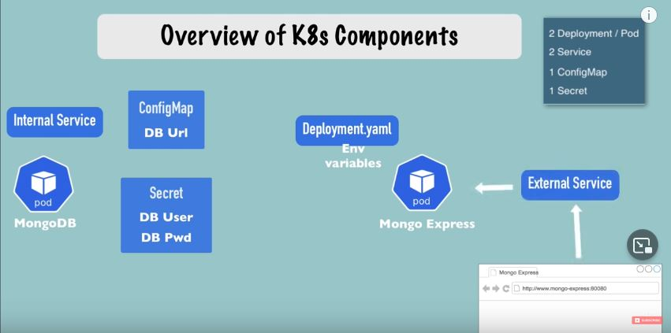

# K8S TUTORIAL:

## Commands:
 > 1- > minikube start --vm-driver=docker <br/>
 > 2- to start by default : > minikube start <br/>
 > 3- to get nodes: > minikube kubectl get nodes <br/>
 > 4- to get cluster status: > minikube status <br/>
 > 5- to show version: > minikube kubectl version <br/>

## Basic kubectl commands:
- create and debug pods in minikube cluster:
    + kubectl (create | edit | delete ) deployment < name > => (create | edit | delete a deployment [ CRUD commands ]);
    + kubectl get (node | pod | service | replicaset ) deployment => (get status of different K8s components);
    + kubectl logs < pod-name > => (log to console);
    + kubectl exec -- -it <podname> --bin/bash => (get interactive container pod terminal);
    + kubectl create -- --help => (get all create commands);

## Create a deployment:
ex: > minikube kubectl create deployment nginx-dept -- --image=nginx => create a deployment of nginx;<br/>
> To verify the deployment: > minikube kubectl get deployment<br/>
> In this exaple we have just one replicaset of nginx to make mode than one we can use the following command:
> + > minikube kubectl create deployment nginx-dept -- --image=nginx --replicas=3

## Layers of abstraction:
To edit the image that we uses we can do it from the deployment:
> $ minikube kubectl edit deployment nginx-dept
> + then we get the autogenerated configuration file.yml => when we edit a deployment a new pod will be created and when this one will run the last one will be died.

## Debugging pods:
> + $ minikube kubectl logs < pod name >
> + $ minikube kubectl describe pod < pod name >
> + $ minikube kubectl exec -it < pod name > --bin/bash => opening of the pod terminal

## Run K8s cluster from cluster file configuration:
> $ minikube kubectl apply -- -f config-file.yml
+ The configuration file for deployment containes 3 parts:
    - What we want to create ex :
    ```
        apiVersion: api/v1
        kind: deployment
    ```
    - 1st part ( where the "metadata" of the creating component resides ) ex:
    ```
        metadata:
            name: nginx-deployment
            labs:
                app: nginx   
    ```
    - 2ed part "specification"( have a specification where basically we put every kind of configuration to apply for that component [ deployment, service ... etc] ) ex:
    ```
        spec:
            replicas: 1
            selector:
                matchLabels: 
                    app: nginx 
                template: 
                    metadata:
                        labels:
                            app: nginx
                    spec:
                        -containers:
                            -name: nginx
                            image: nginx:1.16
                            ports:
                                -containersPort: 80
    ```
    In this example the matching is by label

    - 3ed part "status" automatically generated and edit by k8s,<br/>
    K8s will compare what's the desired state and whats the actual state or the status of that component and if desired is != to actual => k8s try to fixit (self-healing feature k8s provides) the comparison will be with the actual desired specifications to get the actual spec config.<br/>
    The previous configuration status will stay in ( etcd ) => the cluster brain, ETCD holds the curret status of any k8s component.

    ## Blueprint for pods (Template):
    Layers of abstraction (Deployment) -> manages a -> (Replicaset) -> manages a -> (pod) -> abstraction of -> container;
    
    - We manage pods in the 2ed part (spec) -> template -> where template has its own metadata and specification <br/> 
        > A configuration file inside a configuration file the reason is that the second level configuration applies to a pod => pod has his own configuration inside of deployments configuration.

    Complete demo project with 2 application to deploye (mongoDB/mongo-express) (1:16:25) in the following video: [click here](https://www.youtube.com/watch?v=X48VuDVv0do) <br/>
    ### Architecture of the example:
    

    ## Other commands:
    - to run a secret file:
    - > kubectl applu -f mongo-secret.yml  ===> we have to do it before running mongo-deployment because we need the secret configuration.

    ## Namespaces 
    - some method to generate a virtual cluster inside k8s cluster
    - by default k8s offers a namespace default
    - to see all namespaces: -> kubectl get namespaces
    - to create namespace: -> kubectl create namespace < name-space >
    - the usecase is to make order, for example a namespace for database another for api-x ... etc
    - to create something into the defined namespace we can do something like:
    - > kubectl apply -f my-file.yml --namespace=my-namespace
    - > we can do it also into the file configuration it self into metadata: ... namespace: my-namespace

    ## to install ingress controller in minikube run:
    - minikube addons enable ingress